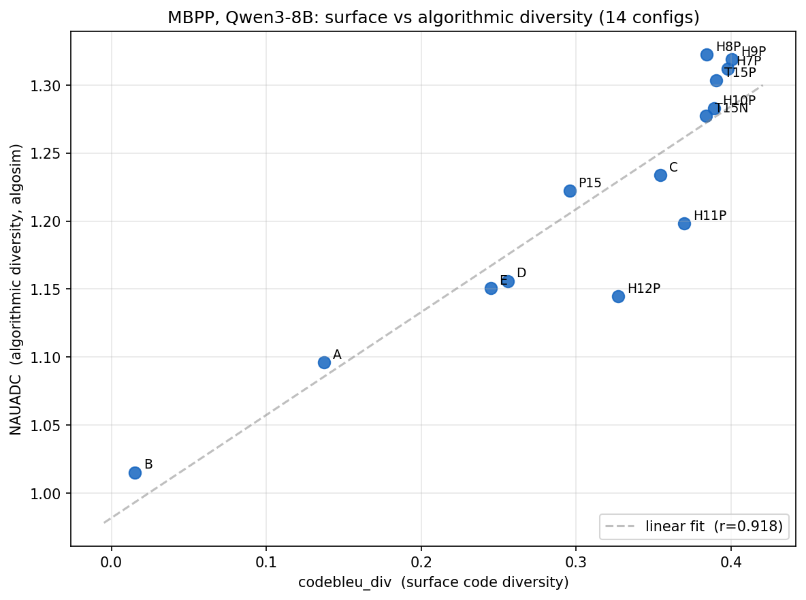

# MBPP NAUADC Deepdive — Sample-level Audit + Metric Correlation


## 1. The 8-config MBPP comparison (recap, cleaned labels)


| Config | Think phase | Code phase | Decode path | pass@1 | pass@10 | struct_div | codebleu_div | NAUADC |
|---|---|---|---|---:|---:|---:|---:|---:|
| **H8P** | `temp @ 1.5` | `pless @ 1.5` | split (manual loop) | 0.811 | 0.898 | 0.206 | 0.384 | **1.322** |
| H9P | `temp @ 1.5` | `pless @ 2.0` | split (manual loop) | 0.807 | 0.908 | 0.217 | 0.401 | 1.319 |
| H7P | `temp @ 1.5` | `pless @ 1.0` | split (manual loop) | 0.805 | 0.910 | 0.214 | 0.398 | 1.312 |
| H10P | `temp @ 1.5` | `pless @ 3.0` | split (manual loop) | 0.803 | 0.906 | 0.202 | 0.389 | **1.283** ← code temp 3.0 hurts |
| T15N | `temp @ 1.5` | `temp @ 1.5` | uniform, HF native `generate()` | 0.799 | 0.888 | 0.200 | 0.384 | 1.277 |
| C | `temp @ 0.6` | `temp @ 0.6` | uniform, HF native `generate()` | 0.738 | 0.834 | 0.167 | 0.354 | 1.234 |
| **P15** | `pless @ 1.5` | `pless @ 1.5` | uniform, manual loop | 0.824 | 0.898 | 0.159 | 0.296 | **1.222** ← pless-think hurts |
| A | *(no thinking)* | `temp @ 0.7` | uniform, HF native `generate()` | 0.662 | 0.734 | 0.057 | 0.137 | 1.096 |

## 2. What NAUADC measures (grounded primer)

From Lee et al. ([arXiv:2503.00691](https://arxiv.org/abs/2503.00691)) §3
and Table 7:

Given **N functionally-correct** samples for a problem, NAUADC is built
in three steps.

1. **Algorithmic clustering** by a pairwise-LLM-judge protocol
   (Algorithm 1 in the paper; we use Llama-3.1-8B-Instruct as in their
   setup). Sample a random representative; ask the judge "similar / novel"
   against all remaining solutions; "similar" ones join the representative's
   cluster, "novel" ones go to the next round; repeat until empty. Produces
   cluster sizes `(s_1, …, s_M)`.
2. **DA@K** (Eq. 1) — the expected number of distinct clusters present
   when sampling K of the N solutions:
   `DA@K = Σ_m [1 − C(N − s_m, K) / C(N, K)]`.
3. **NAUADC** — the normalised area under the DA curve across K = 1…25:
   `AUC(DA@1..DA@25) / 24`.

Interpretation: **NAUADC = 1.0** ⇔ every sample falls in one cluster
("the model always gives essentially the same algorithm"). **NAUADC = 2.0**
⇔ on average two distinct algorithms per problem when you sample 25.
Our MBPP NAUADCs sit in [1.1, 1.3] — a relatively narrow band where
1-2 algorithms dominate per problem.

Why this differs from CodeBLEU: surface metrics fingerprint the
*text*; NAUADC fingerprints the *algorithm* — at least in principle.
Whether that distinction shows up empirically is §4.

## 3. Sample-level audit: H8P vs P15 on three MBPP tasks

The comparison set is **439 common tasks**, derived from MBPP-full's 500:
H8P produced ≥1 passing sample on 449 / 500 tasks, P15 also on 449 / 500
(different missing tasks), and their intersection — the tasks where both
configs had something for algosim to cluster — is 439. The remaining 61
tasks split as 10 H8P-only-solvable, 10 P15-only-solvable, and 41 that
neither config solved with 10 samples. Algosim clusters only correct
samples (paper protocol; enforced at export by
`bench/eval/algosim_export.py:78-92`), so tasks with zero correct samples
drop out of that config's response parquet.

Across those 439 common tasks, H8P produces *more* algorithm clusters
than P15 on **88 tasks (20%)**, ties on **311 (71%)**, and *fewer* on
**40 (9%)**. Mean clusters/task: H8P 1.371 vs P15 1.255 — the source of
the +0.10 NAUADC gap.

Three illustrative tasks, picked from the divergence list to span the
modes (judge-faithful, judge-overconfident-on-text, judge-fooled-on-renames).

### Task 350 — judge is right (3 genuinely distinct algorithms)

> *Write a python function to minimize the length of the string by
> removing occurrence of only one character.*

**H8P** found 3 clusters from 10 samples:

```python
# H8P cluster 0 (n=7) — list comprehension over set
def minimum_Length(s):
    return min(len(s.replace(c, '')) for c in set(s))
```

```python
# H8P cluster 1 (n=2) — frequency-based: drop the most common char
from collections import Counter
def minimum_Length(s):
    counts = Counter(s)
    return len(s) - max(counts.values())
```

```python
# H8P cluster 2 (n=1) — explicit min-tracking loop
def minimum_Length(s):
    min_len = len(s)
    for c in set(s):
        new_len = len(s.replace(c, ''))
        if new_len < min_len:
            min_len = new_len
    return min_len
```

**P15:** all 10 samples in 1 cluster (the comprehension form).

Judge call on cluster-0 vs cluster-1 boundary, decision line: *"Instead
of directly removing characters from the string, it uses a frequency-based
approach to find the minimum length. … Decision: a novel approach."*

**My read.** Faithful. Cluster 1 is genuinely a different algorithm — it
doesn't simulate the removal at all; it computes the answer as
`len(s) − max_count`. Cluster 2 is a stylistic-but-still-distinct variant
of cluster 0 (state-tracking loop vs reduction). Three real algorithmic
choices; NAUADC's call is correct here.

### Task 167 — judge is noisy in both directions

> *Write a python function to find smallest power of 2 greater than or
> equal to n.*

**H8P** clustered 10 samples into 3 groups. But the displayed
representatives reveal the noise:

```python
# H8P cluster 0 representative (sample 1, n=6)
def next_Power_Of_2(n):
    if n == 0: return 1
    if (n & (n - 1)) == 0: return n
    else: return 1 << n.bit_length()
```

```python
# H8P cluster 1 representative (sample 2, n=2)  — BIT-IDENTICAL to sample 1
def next_Power_Of_2(n):
    if n == 0: return 1
    if (n & (n - 1)) == 0: return n
    else: return 1 << n.bit_length()
```

`solutions[1] == solutions[2]` is **`True`** — they're the same string.
They ended up in different clusters because the random first
representative for cluster 0 was sample 6 (a slightly different
formulation using `(n-1).bit_length()`), and when the judge later
compared sample 2 against sample 6 it correctly said "novel" — so
sample 2 became the seed of cluster 1.

That's one direction of noise. The *other* direction: cluster 1 also
contains sample 7, which is a **while-loop** algorithm (`while result <
n: result *= 2`) — fundamentally different from sample 2's bit-shift.
So cluster 1 contains both a near-duplicate of cluster 0 *and* a
genuinely different algorithm. **Two distinct judge errors on the
same problem**: a known-similar pair split apart, and two known-different
algorithms lumped together.

### Task 11 — P15 "wins" but it's a parameter-rename artefact

> *Write a python function to remove first and last occurrence of a
> given character from the string.*

**H8P:** 10 samples, **1 cluster** (all variants of the same find/rfind
slicing approach).

**P15:** 10 samples, **2 clusters**. Cluster reps:

```python
# P15 cluster 0 (n=9)
def remove_Occ(s, char):
    first = s.find(char); ...
```

```python
# P15 cluster 1 (n=1)
def remove_Occ(s, c):        # <-- only difference: parameter name
    first = s.find(c); ...
```

The difference is `char` → `c` in the parameter name. The algorithm is
identical. The judge over-read the rename as a novel approach. P15 is
nominally "more diverse" here only because of judge noise.

### Aggregate verdict on the three picks

NAUADC's verdict was **faithful on 1 of 3** (task 350), **partially
wrong on 1** (task 167 — right cluster count but wrong assignments),
and **driven by judge noise on 1** (task 11). The judge is **directionally
correct on average** — H8P beats P15 by ~0.10 NAUADC over 439 problems,
and the sign of that gap is consistent with H8P producing genuinely
more varied algorithms — but **single-task readings are noisy**. The
aggregate metric is meaningful precisely because the noise averages
out across hundreds of problems.

## 4. Does NAUADC measure something different from CodeBLEU diversity?

Pearson correlations against NAUADC across all 14 final MBPP configs:

| Metric | Pearson r | Spearman ρ |
|---|---:|---:|
| **dataflow_match_diversity** | **0.940** | 0.903 |
| ngram_match_diversity | 0.917 | 0.912 |
| codebleu_div (composite) | 0.918 | 0.912 |
| weighted_ngram_match_diversity | 0.913 | 0.912 |
| syntax_match_diversity | 0.904 | 0.908 |
| struct_div (AST edit distance) | 0.881 | 0.868 |

All six surface metrics correlate **very strongly** with NAUADC
(r ≥ 0.88). Dataflow leads at r = 0.940 — it captures variable-flow DAG
structure, the closest surface proxy for "what does the program actually
compute". Strict AST edit distance lags slightly behind because it
penalises identifier-level differences that NAUADC's LLM judge often
ignores.



**Where the two metrics disagree** (residuals from the linear fit):

- **H10P** is the headline outlier — code-phase `pless @ 3.0` gives
  H10P codebleu_div = 0.389 (right in the H-series band) but NAUADC
  drops to 1.283 (below the H7P / H8P / H9P band by ~0.03). Surface
  diversity is preserved while algorithmic diversity falls. Reading:
  at code temp 3.0 the model emits *syntactically* varied code that
  computes the same thing more often.
- **H8P vs H9P / H7P** — H8P has the lowest codebleu_div in the
  H-series (0.384) yet the highest NAUADC (1.322). Same observation
  in miniature: H8P's samples are slightly more textually similar to
  each other but slightly more algorithmically distinct. Whether this
  is a robust signal or noise at the third decimal we can't say from
  14 datapoints.

**Are they measuring different things?** Mostly **no** — they co-vary
strongly. They measure different *aspects* of the same underlying
"how varied are correct samples" phenomenon, but those aspects are
heavily correlated at config-level granularity. NAUADC adds clear
incremental signal in exactly the regimes the parent doc flagged:
**at hot code-side pless temperatures, surface diversity stays
inflated while algorithmic diversity drops** — H10P is the cleanest
example. For ranking purposes on MBPP, our surface metrics are
~90% of the way to NAUADC. The remaining ~10% is where the
"text-different but algorithm-same" cases hide, and those tend to
matter precisely at the configurations we'd most want to differentiate.

## 5. Bottom line

- **The MBPP within-Qwen3-8B ranking holds across surface and
  algorithmic metrics** — H8P top, P15 floor, monotone in between.
  The two metric families agree at config-level granularity.
- **Sample-level NAUADC is noisy** — the random initialisation of the
  clustering algorithm and the LLM judge's inconsistency on near-duplicate
  code can split identical samples and merge different algorithms on
  the same task. The metric is useful in aggregate, not for single-task
  case studies.
- **The clearest cross-metric divergence is H10P** — surface metrics
  miss the algorithmic-collapse-at-high-code-temperature finding that
  NAUADC picks up. That's the main empirical value-add of running
  algosim on top of our existing pipeline.
