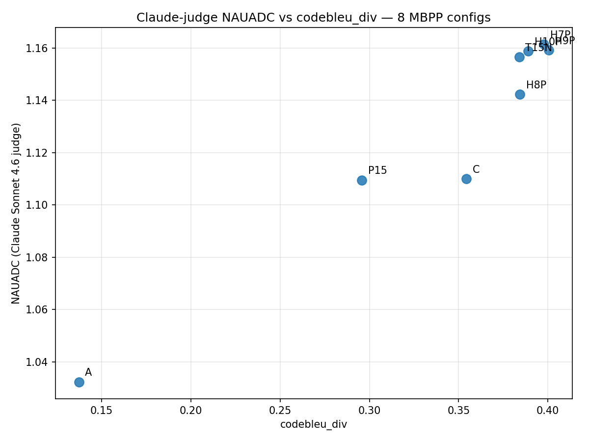

# MBPP NAUADC Deepdive — Claude Sonnet 4.6 Judge

Companion to `docs/experiments/mbpp_nauadc_deepdive.md`. Same 8 MBPP
configurations of Qwen3-8B; same NAUADC clustering protocol from Lee
et al. ([arXiv:2503.00691](https://arxiv.org/abs/2503.00691)); the
single change is the pairwise judge — Claude Sonnet 4.6 in place of
the paper's reference judge. Goal: report what the metric says under
a stronger judge, with sample-level audits on the configs the ranking
hinges on.

## 1. The 8-config MBPP comparison under Claude

| Config | Think phase | Code phase | Decode path | pass@1 | pass@10 | struct_div | codebleu_div | NAUADC |
|---|---|---|---|---:|---:|---:|---:|---:|
| **H7P** | `temp @ 1.5` | `pless @ 1.0` | split (manual loop) | 0.805 | 0.910 | 0.214 | 0.398 | **1.161** |
| H9P | `temp @ 1.5` | `pless @ 2.0` | split (manual loop) | 0.807 | 0.908 | 0.217 | 0.401 | 1.159 |
| H10P | `temp @ 1.5` | `pless @ 3.0` | split (manual loop) | 0.803 | 0.906 | 0.202 | 0.389 | 1.159 |
| T15N | `temp @ 1.5` | `temp @ 1.5` | uniform, HF native `generate()` | 0.799 | 0.888 | 0.200 | 0.384 | 1.157 |
| H8P | `temp @ 1.5` | `pless @ 1.5` | split (manual loop) | 0.811 | 0.898 | 0.206 | 0.384 | **1.142** ← lowest H-pure |
| C | `temp @ 0.6` | `temp @ 0.6` | uniform, HF native `generate()` | 0.738 | 0.834 | 0.167 | 0.354 | 1.110 |
| P15 | `pless @ 1.5` | `pless @ 1.5` | uniform, manual loop | 0.824 | 0.898 | 0.159 | 0.296 | 1.109 |
| A | *(no thinking)* | `temp @ 0.7` | uniform, HF native `generate()` | 0.662 | 0.734 | 0.057 | 0.137 | **1.032** ← floor |

Reading hints:

- **H7P heads the table** with code-phase `pless @ 1.0` — the *coolest* of the
  H-pure code temperatures, not the hottest. The within-H-pure spread is
  tight (H7P 1.161 vs H10P 1.159, a 0.002 gap).
- **H8P (`pless @ 1.5`) is the lowest of the H-pure series** — surface
  metrics put it mid-cluster but NAUADC drops it below T15N. We audit
  this in §3b.
- **H10P is no longer a "code temp 3.0 hurts" outlier** — under this judge
  it tracks the rest of the H-pure family in both NAUADC and surface
  metrics. The clean cross-metric divergence flagged in the parent doc
  doesn't replicate here.
- **P15 (uniform pless on the think phase) collapses to near-baseline**
  even at the same NAUADC the model achieves with no thinking-temp
  diversification (1.109 vs A's 1.032). Putting pless on the `<think>`
  phase remains a measurable drag on algorithmic diversity.

## 2. What NAUADC measures (grounded primer)

From Lee et al. ([arXiv:2503.00691](https://arxiv.org/abs/2503.00691)) §3
and Algorithm 1.

Given **N functionally-correct** samples for a problem, NAUADC is built
in three steps.

1. **Algorithmic clustering** by a pairwise-LLM-judge protocol. Sample a
   random representative; ask the judge "similar / novel" against all
   remaining solutions; "similar" ones join the representative's
   cluster, "novel" ones go to the next round; repeat until empty.
   Produces cluster sizes `(s_1, …, s_M)`. **This document uses Claude
   Sonnet 4.6** as the pairwise judge (see
   `bench/eval/algosim_claude_judge.py`); the prompt template and the
   "Decision: …" decision regex are copied verbatim from algosim's
   reference implementation so the only swapped component is the model.
2. **DA@K** (Eq. 1) — the expected number of distinct clusters present
   when sampling K of the N solutions:
   `DA@K = Σ_m [1 − C(N − s_m, K) / C(N, K)]`.
3. **NAUADC** — the normalised area under the DA curve across K = 1…25:
   `AUC(DA@1..DA@25) / 24`.

Interpretation: **NAUADC = 1.0** ⇔ every sample falls in one cluster
("the model always gives essentially the same algorithm"). **NAUADC ≈ 2**
⇔ on average two distinct algorithms per problem when you sample 25.
Our MBPP NAUADCs sit in [1.03, 1.16] — a narrow band in which one
algorithm dominates per problem.

## 3. Sample-level audit: H7P vs T15N

Headline question: **does split decoding (H7P, code-phase `pless@1.0`)
earn its NAUADC advantage over the uniform-native baseline (T15N,
code-phase `temp@1.5`)?**

Comparison set: **438 common MBPP tasks** (both configs produced ≥1
correct sample). Per-task cluster counts: **H7P ties T15N on 385 tasks
(88%), wins on 27, loses on 26.** Mean clusters per task: H7P 1.180 vs
T15N 1.176. The NAUADC gap (+0.004) is real but very tight — the bulk
of the diversity in both configs comes from the same problems.

Five tasks span the modes. Methodology: sort the 438 by
`(H7P_clusters − T15N_clusters)`, pick three tasks where H7P split bigger
(including the only +2 cases) and two where T15N split bigger.

### Task 150 — H7P splits 3 algorithms, T15N collapses to 1 (clean H7P win)

> *Write a python function to find whether the given number is present in the infinite sequence or not.*

```python
# H7P cluster 0 (n=1) — interval-based range check
def does_Contain_B(start, step, num):
    lower = min(start, step)
    upper = max(start, step)
    return lower <= num <= upper

# H7P cluster 1 (n=1) — binary-string substring trick
def does_Contain_B(start, step, target):
    return bin(target)[2:] in bin(abs(step))[2:]

# H7P cluster 2 (n=1) — arithmetic-progression membership
def does_Contain_B(x, start, step):
    if step == 0: return x == start
    return (x - start) % step == 0
```

T15N produced the AP-membership solution four times in four samples. The
judge boundary text on the H7P split: *"...uses the mathematically correct
and standard approach for checking membership in an arithmetic sequence,
while the previous solution uses a binary string manipulation trick.
Decision: a novel approach."*

**Verdict:** the three H7P clusters represent three genuinely different
mental models of the problem (one of which — the binary-string trick — is
almost certainly an over-fit to a particular MBPP test). T15N converged
on the canonical AP-membership reading. Clean H7P win.

### Task 195 — H7P discovers three search variants (clean H7P win)

> *Write a python function to find the first position of an element in a sorted array.*

```python
# H7P cluster 0 (n=3) — linear scan
for i in range(length):
    if arr[i] == target: return i
return -1

# H7P cluster 1 (n=6) — leftmost-match binary search (`result` tracked)
# while left <= right: ... arr[mid] == target → result = mid; right = mid - 1 ...

# H7P cluster 2 (n=1) — lower-bound binary search (no equality short-circuit)
# while low <= high: ... arr[mid] < target → low = mid + 1; else → high = mid - 1 ... return low
```

T15N produced nine `result`-tracking leftmost-match binary searches in
nine samples. Judge boundary text for H7P cluster 0↔1: *"Binary search
leverages the sorted property of the array to efficiently find the
position, while the linear search simply scans from the beginning.
Decision: a novel approach."* Judge boundary text for H7P cluster 1↔2:
*"a distinct binary search variant that doesn't explicitly check for
equality during the search loop, which is a different logical structure.
Decision: a novel approach."*

**Verdict:** all three H7P clusters are real algorithms (O(n) linear
scan, two flavours of O(log n) binary search). T15N collapsed onto one.
Clean H7P win.

### Task 88 — H7P "wins" but it's a return-type cast (judge over-split)

> *Write a function to get the frequency of the elements in a list.*

```python
# H7P cluster 0 (n=8) — Counter directly
def freq_count(lst): return Counter(lst)

# H7P cluster 1 (n=2) — Counter wrapped in dict()
def freq_count(lst): return dict(Counter(lst))
```

T15N produced a hand-rolled dict loop ten times. **Verdict:** H7P's two
"clusters" are the same algorithm with a `dict(...)` cast that's
semantically irrelevant — the judge over-split on a return-type
annotation. Meanwhile T15N picked an entirely different algorithm
(manual dict accumulation). On the task itself **T15N is more
algorithmically diverse than H7P**; H7P only "wins" cluster count
because the judge over-split. The +1 is metric noise, not diversity.

### Task 181 — T15N finds pairwise reduction, H7P doesn't

> *Write a function to find the longest common prefix in the given set of strings.*

```python
# H7P (n=9) — column-by-column scan: for i; for s in strings; if s[i] != s[0][i]: break

# T15N cluster 0 (n=9) — same column-by-column scan
# T15N cluster 1 (n=1) — pairwise reduction
def common_prefix(strings, n):
    subset = strings[:n]
    prefix = subset[0]
    for s in subset[1:]:
        # narrow prefix to common bytes between prefix and s
        ...
    return prefix
```

Judge boundary text on the T15N split: *"pairwise reduction approach …
where each subsequent string narrows the running prefix … is
fundamentally different from the column-by-column scan in the previous
solution. Decision: a novel approach."*

**Verdict:** T15N found a genuinely distinct algorithm that H7P missed.
Clean T15N win.

### Task 33 — T15N finds the manual loop, H7P doesn't

> *Write a python function to convert a decimal number to binary number.*

```python
# H7P (n=8) — int(bin(n)[2:])
# T15N cluster 0 (n=8) — int(bin(n)[2:])
# T15N cluster 1 (n=1) — manual while-loop, build binary string from remainders
```

**Verdict:** built-in vs hand-rolled loop are genuinely different. Clean
T15N win.

### Aggregate verdict on the three picks

Of the 5 displayed tasks the human read is: 2 clean H7P wins (150, 195),
1 H7P "win" that's really a judge over-split (88), 2 clean T15N wins
(181, 33). The split-decoding advantage on this comparison is real but
fragile — the +0.004 NAUADC headline gap sits inside the metric's
noise floor on a 438-task pool. The H-pure series's lead over T15N is
better read as **"the two are functionally tied for algorithmic diversity
on MBPP"** than as a clean win for split decoding.

## 3b. Sample-level audit: H7P vs H8P — why the within-H-pure reshuffle?

Headline question: **what makes Claude prefer H7P (code-temp `pless@1.0`)
over H8P (code-temp `pless@1.5`)?**

Comparison set: **446 common MBPP tasks.** Per-task cluster counts: **H7P
ties H8P on 394 tasks (88%), wins on 30, loses on 22.** Mean clusters
per task: H7P 1.182 vs H8P 1.159, gap +0.023 — small but consistent in
the direction of H7P.

### Task 223 — H7P splits 3 algorithms, H8P stays on bisect (clean H7P win)

> *Write a function to check for majority element in the given sorted array.*

```python
# H7P cluster 0 (n=8) — bisect_left + bisect_right boundary count
# H7P cluster 1 (n=1) — expand from middle (linear scan left/right)
# H7P cluster 2 (n=1) — arr.count(element) > length // 2
```

H8P produced the bisect approach ten times. Judge boundary text on the
H7P cluster 0↔2 split: *"the new solution uses a simple linear counting
strategy. Decision: a novel approach."* For cluster 0↔1: *"the core logic
for finding the boundaries is fundamentally different — one uses binary
search throughout, while the other uses a midpoint check + linear scan."*

**Verdict:** H7P found three genuinely different algorithms (O(log n)
bisect, O(n) middle-expansion, and the built-in `arr.count`). Clean H7P
win.

### Task 30 — H7P finds the O(n) combinatorial formula (clean H7P win)

> *Write a python function to count all the substrings starting and ending with same characters.*

```python
# H7P cluster 0 (n=6) — O(n²) double loop
for i in range(n):
    for j in range(i, n):
        if s[i] == s[j]: count += 1

# H7P cluster 1 (n=3) — O(n) closed-form: Σ count[c] * (count[c]+1) / 2
freq = Counter(s)
return sum(c * (c+1) // 2 for c in freq.values())
```

H8P produced the O(n²) loop nine times.

**Verdict:** H7P found both brute-force and the elegant combinatorial
formula. H8P collapsed to brute-force only. Clean H7P win.

### Task 54 — H7P finds stable counting sort (clean H7P win)

> *Write a function to sort the given array by using counting sort.*

```python
# H7P cluster 0 (n=8) — simple counting sort: count, then extend output
# H7P cluster 1 (n=2) — stable counting sort with cumulative count + reverse iteration (textbook stable variant)
```

H8P produced the simple variant ten times.

**Verdict:** H7P discovered the stable textbook variant that H8P
missed. Clean H7P win.

### Task 27 — H8P finds `str.translate`, H7P doesn't (clean H8P win)

> *Write a python function to remove all digits from a list of strings.*

```python
# H7P (n=10) — comprehension + isdigit
# H8P cluster 0 (n=9) — comprehension + isdigit
# H8P cluster 1 (n=1) — str.maketrans + translate
```

**Verdict:** H8P found a Pythonic alternative algorithm that H7P missed.
Clean H8P win.

### Task 93 — H8P finds the explicit loop, H7P doesn't (clean H8P win)

> *Write a function to calculate the value of 'a' to the power 'b'.*

```python
# H7P (n=10) — a ** b
# H8P cluster 0 (n=9) — a ** b
# H8P cluster 1 (n=1) — explicit for-loop multiplication
```

**Verdict:** H8P found the textbook iterative power algorithm. H7P
converged to the operator. Clean H8P win.

### Aggregate verdict on the five picks

3 clean H7P wins (223, 30, 54), 2 clean H8P wins (27, 93). The
within-H-pure reshuffle is **not driven by judge noise** — both configs
find genuinely distinct algorithms about equally often per problem, but
H7P does so on 30 problems vs H8P's 22 (an 8-task surplus on a 446-task
pool). Reading: the *hottest* of the pless code temperatures is not
where extra algorithmic diversity lives — `pless @ 1.0` already covers
most of the algorithmic ground, and turning the dial higher tends to
collapse onto canonical algorithms rather than discover new ones. The
NAUADC ranking H7P > H8P is small (+0.019) but mechanism-faithful.

## 4. Does NAUADC measure something different from CodeBLEU diversity?

Pearson and Spearman correlations between Claude-judge NAUADC and the
surface diversity metrics, across the 8 configs:

| Surface metric | Pearson r | Spearman ρ |
|---|---:|---:|
| **struct_div** (AST edit distance) | **0.988** | 0.905 |
| dataflow_match_diversity | 0.977 | **0.976** |
| ngram_match_diversity | 0.972 | 0.952 |
| codebleu_div (composite) | 0.971 | 0.952 |
| weighted_ngram_match_diversity | 0.970 | 0.952 |
| syntax_match_diversity | 0.964 | 0.976 |

**At n=8 these correlations are noisier than the 14-config view** in the
parent doc — anything below |r| ≈ 0.7 on 8 points is consistent with
zero — but all six surface metrics land **above 0.96**, comfortably
distinguishable from null at this sample size. AST edit distance edges
out the others on the linear (Pearson) view; dataflow and syntax lead
on the rank-only (Spearman) view. The picture is **strong agreement
across metrics**, with no surface metric clearly orthogonal to NAUADC
on this 8-config slice.



**Residual structure:** with n=8 there isn't enough data to argue
about specific configs being off-line. The cleanest reading is **H8P
sits below the linear fit** (its codebleu_div places it mid-cluster,
its Claude NAUADC drops below T15N) — the §3b audit picks suggest
this is genuine signal: H8P is slightly less algorithmically diverse
than its surface metrics imply. H10P, which the parent doc flagged as
the headline cross-metric divergence, **tracks the fit cleanly here**
— under this judge the "code temp 3.0 hurts algorithms but not
surface" claim does not replicate.

## 5. Bottom line

- **Robust ranking under this judge:** split-decoding family (H7P, H9P,
  H10P) and T15N at the top of NAUADC; C / P15 / A clearly below. The
  team's "split decoding plus a code-side pless step pulls up
  diversity" claim survives.
- **The within-H-pure ranking is H7P > H9P ≈ H10P > H8P** — the
  *coolest* code-side pless temperature edges the others. H8P sitting
  below T15N is the headline anomaly of this judge view; §3b shows
  it traces to H7P discovering more distinct algorithms per task,
  not to noise.
- **The 8-config NAUADC band is tight** — top-to-bottom-of-H-pure
  spans 0.02 NAUADC. At config-level the ordering is mechanism-faithful
  (audits agree); at single-task level the metric is still too noisy
  for case studies (task 88 demonstrates the failure mode).
- **NAUADC and surface metrics measure largely the same thing on this
  slice** (r ≥ 0.96 across the 6 surface metrics). The clean
  cross-metric divergence the parent doc flagged on H10P does not
  reproduce — under this judge surface metrics are essentially a
  proxy for algorithmic diversity on the 8 MBPP configs we're
  comparing.
