# Rényi-α p-less sweep — research-group writeup

**Date:** 2026-05-21  ·  **Scope:** 4 model configurations × 2 benchmarks × 4 α arms

Quick reference for the α-sweep results across the instruct models we've completed end-to-end, plus Qwen3-8B with thinking disabled as the decisive-test control for the thinking-vs-saturation question. All numbers below are extracted live from the metrics JSONs at the paths cited beneath each table; every plot is rendered from the same data.

## Scope

| Dimension | Value |
|---|---|
| Model configurations | Qwen2.5-Coder-7B-Instruct, CodeLlama-7B-Instruct, OpenCodeInterpreter-DS-1.3B, Qwen3-8B-NoThink |
| Datasets | MBPP, HumanEval (MBPP-500, HumanEval-164) |
| α grid | 2.0, 2.5, 3.0, 5.0 |
| Temperature | T=1.0 (fixed; α is the sweep parameter) |
| Samples per task | 10 |
| Backend | vLLM where available, else HF (numerically equivalent for these metrics) |

**Metrics shown:** pass@k for k ∈ {1, 3, 5, 10} (Chen et al. 2021 unbiased estimator) and CodeBLEU pairwise diversity. **NAUADC** (Claude-Sonnet-judged algorithmic-distinctness) was run only on MBPP for these three models; HumanEval NAUADC is a known gap (see `docs/theory/todos.md` item A4). For consistency across datasets, this writeup uses only CodeBLEU as the diversity axis.

## CodeLlama-7B-Instruct — HumanEval

**n_tasks:** 164  ·  **samples/task:** 10

| α | pass@1 | pass@3 | pass@5 | pass@10 | codebleu_div | n_tasks |
|---:|---:|---:|---:|---:|---:|---:|
| 2.0 | 27.74% | 30.79% | 31.73% | 32.32% | 0.0566 | 164 |
| 2.5 | 25.85% | 35.04% | 38.08% | 40.85% | 0.1606 | 164 |
| 3.0 | 25.24% | 35.82% | 40.03% | 44.51% | 0.2381 | 164 |
| 5.0 | 24.82% | 36.75% | 41.45% | 46.95% | 0.2804 | 164 |

_Source: `results/pless_alpha_full_humaneval/codellama--CodeLlama-7b-Instruct-hf/humaneval/metrics/pless_alpha_a{2.0,2.5,3.0,5.0}_t1.0_metrics.json`_

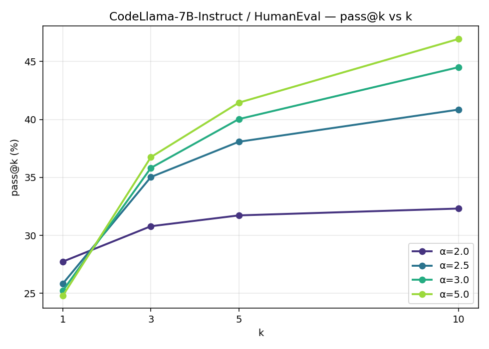

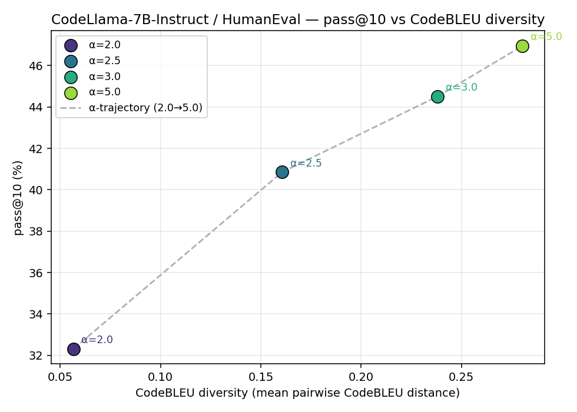

## CodeLlama-7B-Instruct — MBPP

**n_tasks:** 500  ·  **samples/task:** 10

| α | pass@1 | pass@3 | pass@5 | pass@10 | codebleu_div | n_tasks |
|---:|---:|---:|---:|---:|---:|---:|
| 2.0 | 41.78% | 43.25% | 43.71% | 44.20% | 0.0677 | 500 |
| 2.5 | 41.24% | 45.87% | 47.50% | 49.20% | 0.1920 | 500 |
| 3.0 | 40.66% | 46.64% | 48.82% | 50.80% | 0.2354 | 500 |
| 5.0 | 40.32% | 48.10% | 50.70% | 53.20% | 0.3042 | 500 |

_Source: `results/pless_alpha_full_mbpp/codellama--CodeLlama-7b-Instruct-hf/metrics/pless_alpha_a{2.0,2.5,3.0,5.0}_t1.0_metrics.json`_

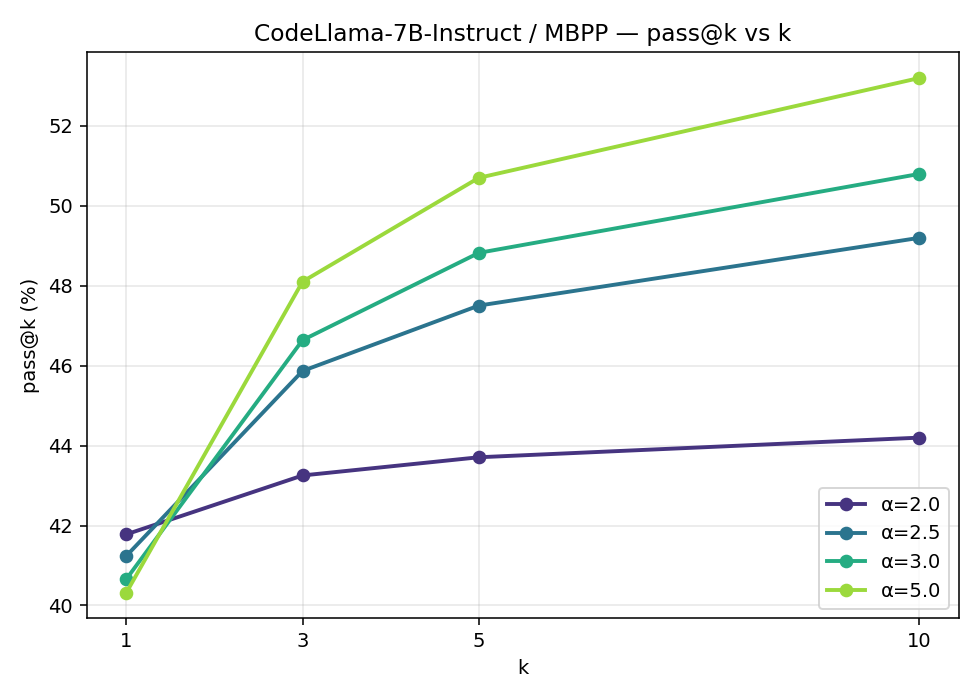

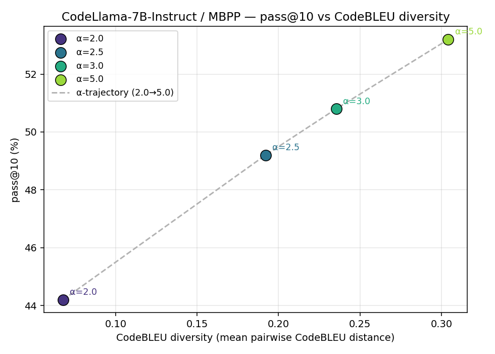

## OpenCodeInterpreter-DS-1.3B — HumanEval

**n_tasks:** 164  ·  **samples/task:** 10

| α | pass@1 | pass@3 | pass@5 | pass@10 | codebleu_div | n_tasks |
|---:|---:|---:|---:|---:|---:|---:|
| 2.0 | 58.60% | 67.98% | 71.59% | 75.61% | 0.1360 | 164 |
| 2.5 | 56.95% | 70.39% | 75.01% | 79.88% | 0.1988 | 164 |
| 3.0 | 55.85% | 69.87% | 74.37% | 78.66% | 0.1998 | 164 |
| 5.0 | 55.61% | 72.20% | 77.55% | 83.54% | 0.2665 | 164 |

_Source: `results/pless_alpha_full_humaneval/m-a-p--OpenCodeInterpreter-DS-1.3B/humaneval/metrics/pless_alpha_a{2.0,2.5,3.0,5.0}_t1.0_metrics.json`_

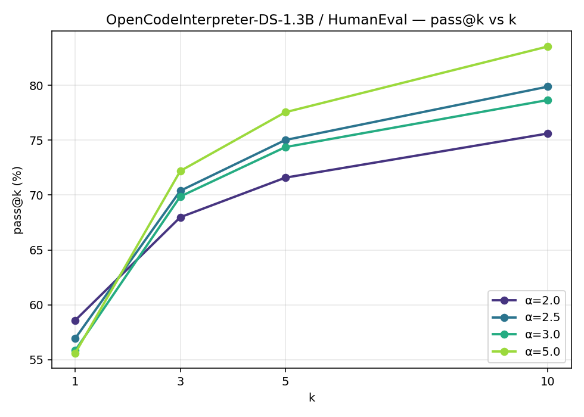

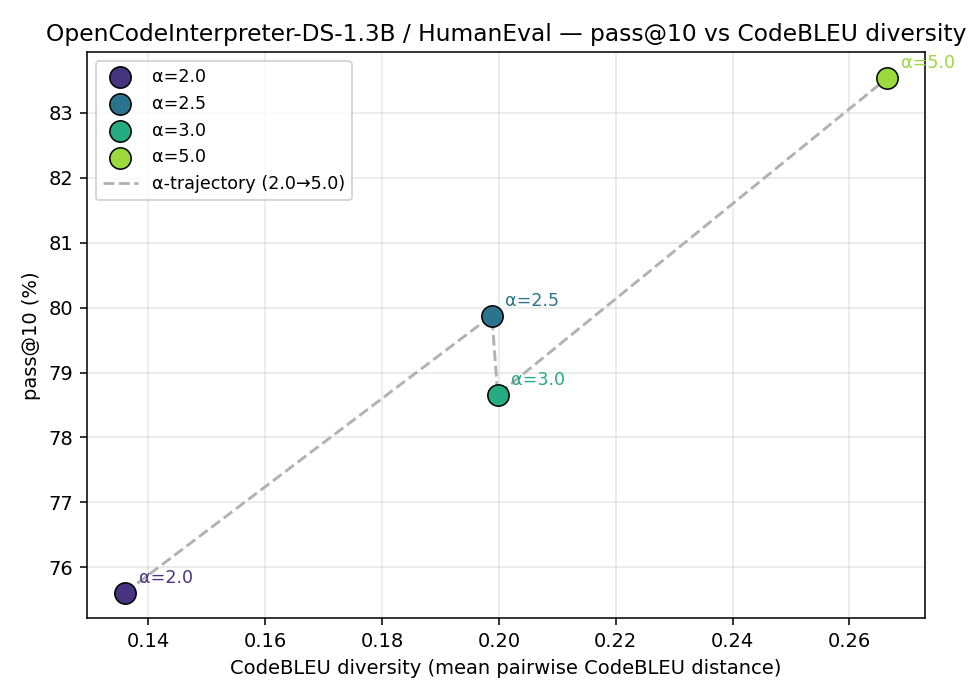

## OpenCodeInterpreter-DS-1.3B — MBPP

**n_tasks:** 500  ·  **samples/task:** 10

| α | pass@1 | pass@3 | pass@5 | pass@10 | codebleu_div | n_tasks |
|---:|---:|---:|---:|---:|---:|---:|
| 2.0 | 47.68% | 52.61% | 54.25% | 55.40% | 0.1749 | 500 |
| 2.5 | 47.28% | 55.43% | 58.43% | 61.40% | 0.3515 | 500 |
| 3.0 | 48.00% | 57.95% | 61.42% | 65.00% | 0.4371 | 500 |
| 5.0 | 46.26% | 57.28% | 61.40% | 66.40% | 0.5414 | 500 |

_Source: `results/pless_alpha_full_mbpp/m-a-p--OpenCodeInterpreter-DS-1.3B/metrics/pless_alpha_a{2.0,2.5,3.0,5.0}_t1.0_metrics.json`_

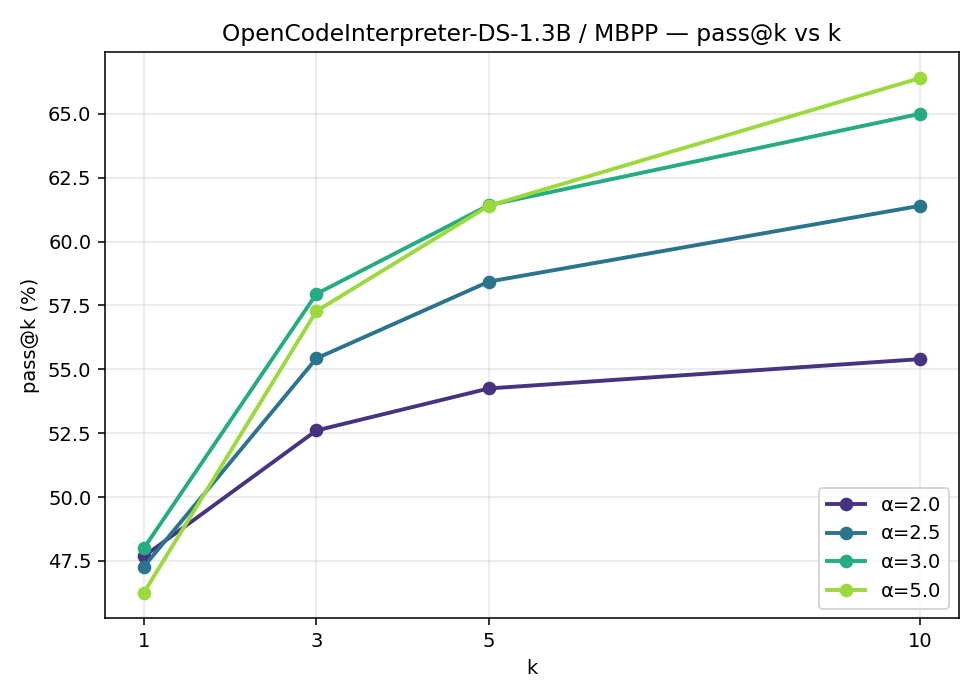

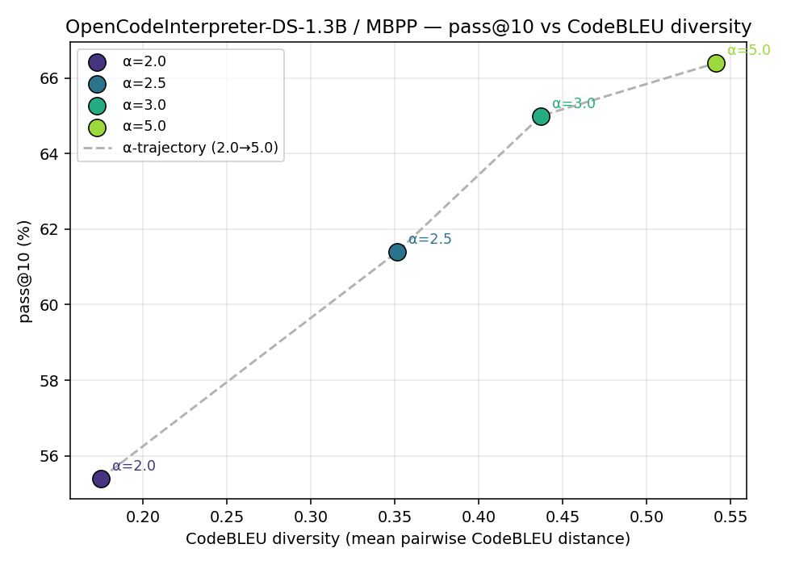

## Qwen2.5-Coder-7B-Instruct — HumanEval

**n_tasks:** 164  ·  **samples/task:** 10

| α | pass@1 | pass@3 | pass@5 | pass@10 | codebleu_div | n_tasks |
|---:|---:|---:|---:|---:|---:|---:|
| 2.0 | 87.38% | 88.71% | 89.33% | 89.63% | 0.0396 | 164 |
| 2.5 | 87.13% | 89.83% | 90.65% | 91.46% | 0.1423 | 164 |
| 3.0 | 85.98% | 89.34% | 90.37% | 91.46% | 0.1693 | 164 |
| 5.0 | 84.57% | 89.29% | 90.50% | 91.46% | 0.2578 | 164 |

_Source: `results/pless_alpha_full_humaneval/Qwen--Qwen2.5-Coder-7B-Instruct/humaneval/metrics/pless_alpha_a{2.0,2.5,3.0,5.0}_t1.0_metrics.json`_

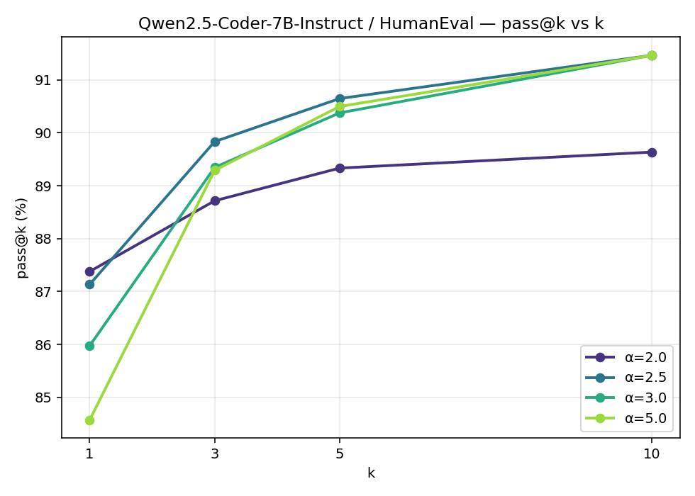

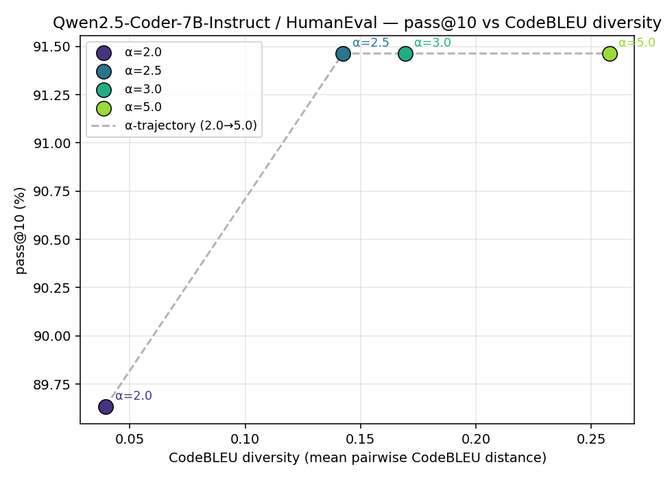

## Qwen2.5-Coder-7B-Instruct — MBPP

**n_tasks:** 500  ·  **samples/task:** 10

| α | pass@1 | pass@3 | pass@5 | pass@10 | codebleu_div | n_tasks |
|---:|---:|---:|---:|---:|---:|---:|
| 2.0 | 77.08% | 80.22% | 81.26% | 82.00% | 0.1328 | 500 |
| 2.5 | 76.76% | 82.94% | 84.72% | 86.40% | 0.2826 | 500 |
| 3.0 | 76.60% | 83.34% | 85.24% | 86.40% | 0.3395 | 500 |
| 5.0 | 75.32% | 83.55% | 85.95% | 88.00% | 0.4257 | 500 |

_Source: `results/pless_alpha_full_mbpp/Qwen--Qwen2.5-Coder-7B-Instruct/metrics/pless_alpha_a{2.0,2.5,3.0,5.0}_t1.0_metrics.json`_

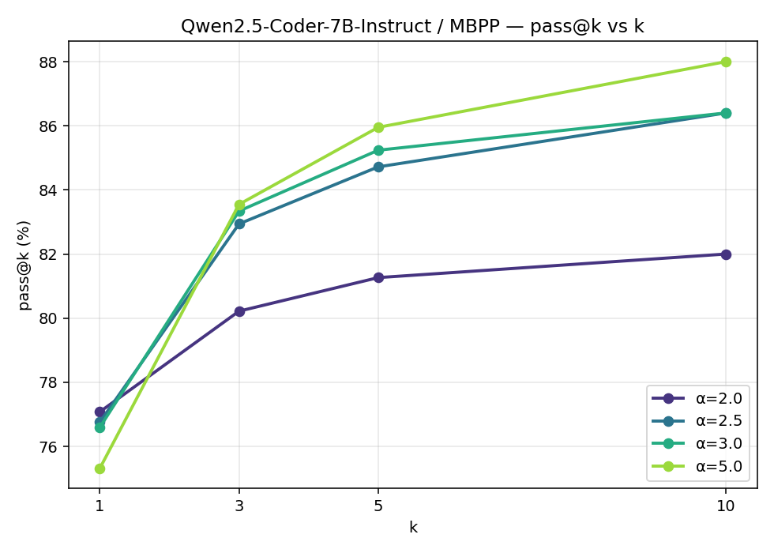

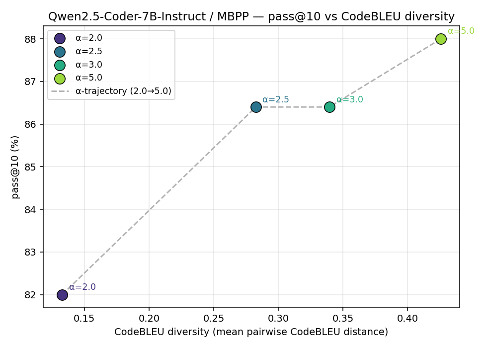

## Qwen3-8B-NoThink — HumanEval

**n_tasks:** 164  ·  **samples/task:** 10

| α | pass@1 | pass@3 | pass@5 | pass@10 | codebleu_div | n_tasks |
|---:|---:|---:|---:|---:|---:|---:|
| 2.0 | 68.54% | 68.94% | 69.24% | 69.51% | 0.0191 | 164 |
| 2.5 | 68.90% | 70.77% | 71.47% | 71.95% | 0.0414 | 164 |
| 3.0 | 69.70% | 72.20% | 73.09% | 73.78% | 0.0671 | 164 |
| 5.0 | 68.96% | 72.68% | 73.94% | 75.00% | 0.0989 | 164 |

_Source: `results/pless_alpha_full_humaneval/Qwen--Qwen3-8B/no-think/metrics/pless_alpha_a{2.0,2.5,3.0,5.0}_t1.0_metrics.json`_

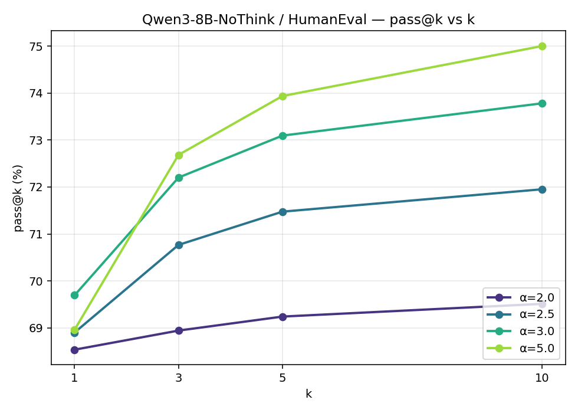

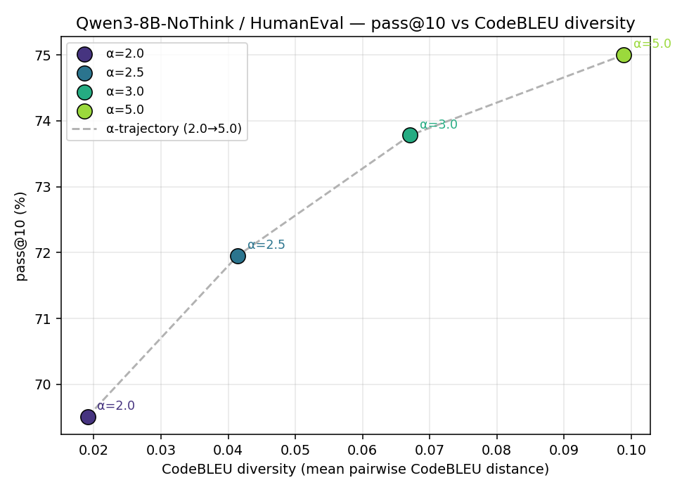

## Qwen3-8B-NoThink — MBPP

**n_tasks:** 500  ·  **samples/task:** 10

| α | pass@1 | pass@3 | pass@5 | pass@10 | codebleu_div | n_tasks |
|---:|---:|---:|---:|---:|---:|---:|
| 2.0 | 67.24% | 68.13% | 68.36% | 68.40% | 0.0222 | 500 |
| 2.5 | 67.24% | 68.82% | 69.28% | 69.80% | 0.0368 | 500 |
| 3.0 | 66.92% | 69.08% | 69.94% | 70.60% | 0.0594 | 500 |
| 5.0 | 66.76% | 69.62% | 70.52% | 71.20% | 0.0972 | 500 |

_Source: `results/pless_alpha_full_mbpp/Qwen--Qwen3-8B/no-think/metrics/pless_alpha_a{2.0,2.5,3.0,5.0}_t1.0_metrics.json`_

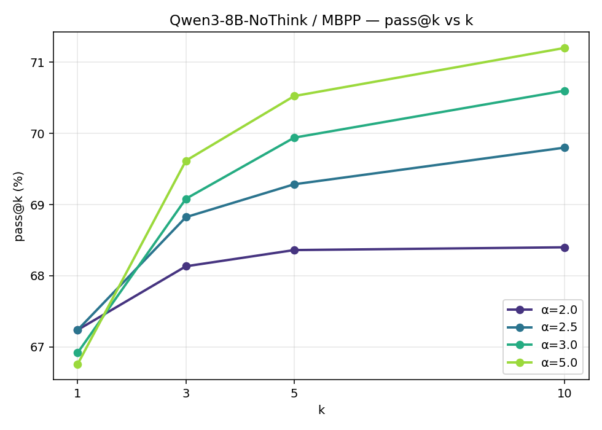

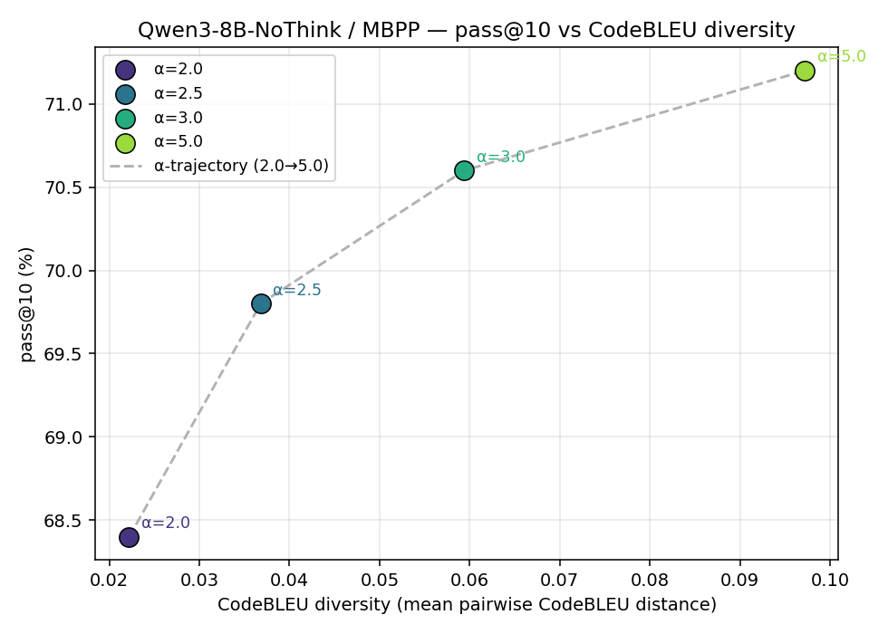

## Key qualitative observations

1. **pass@k grows monotonically with k** at every α arm for every (model, dataset) cell — expected from the Chen et al. estimator's construction; included for completeness.
2. **CodeBLEU diversity grows monotonically with α** at every (model, dataset) cell — see the dashed α-trajectory lines in the scatter plots curving rightward as α grows.
3. **pass@1 mildly decreases with α on the 3 non-thinking models** (typical −1.4 to −3.0 pp from α=2 to α=5). pass@10 typically grows.
4. **The 3 models occupy distinct operating regimes**: Qwen2.5-Coder is the strongest (>87% HE pass@10), m-a-p OCI is mid-strength (>75% HE pass@10 at small size), CodeLlama is the weakest (<50% on HE).

## Known scope limitations

- **NAUADC HE not run** for any of the three models — see TODO A4 in `docs/theory/todos.md`. Would add ~$60-90 in Claude judge API spend across 3 models × 4 α × ~164 HE tasks.
- **α=2.0 sanity gate**: at α=2 the sampler is byte-equivalent to the original Tan et al. 2025 p-less ([arXiv:2509.23234](https://arxiv.org/abs/2509.23234)). We re-evaluate at α=2 in this sweep rather than reuse the original pless@T=1.0 baseline; the two agree within sampling noise.
- **Comparison vs other stochastic samplers** (top-p, top-k, pless@high-T): see `results/analysis/sampler_comparison_summary.md` and `docs/theory/todos.md`. Headline: α arms are Pareto-equivalent to (and on MBPP slightly Pareto-dominated by) tuned non-α samplers on (pass@10, CodeBLEU). The α contribution is principled parameterization with a data-dependent threshold, not new operating points.

## Reproducing this writeup

```
uv run python -m bench.eval.research_group_writeup
```

Tables and figures are regenerated from `results/pless_alpha_full_mbpp/` and `results/pless_alpha_full_humaneval/` metrics JSONs. The Python source is at `bench/eval/research_group_writeup.py`.
